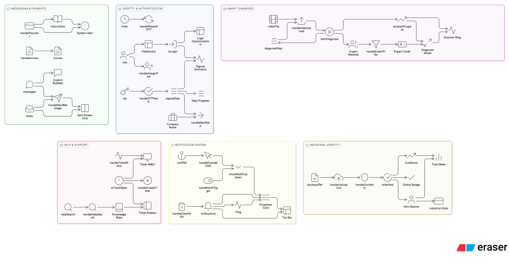

# origiNode 🛡️
**Tracing the source to keep your business moving.**

origiNode is a specialized industrial platform designed to provide continuity for legacy machinery. It connects consumers with experts to diagnose, maintain, and source parts for aging industrial assets.

## 🚀 Features

- **Expert Terminal**: A dedicated dashboard for industrial specialists to manage service requests, track earnings, and communicate with clients.
- **Consumer Control Center**: Manage your industrial fleet, track machine health, and access historical maintenance logs.
- **Smart Video Diagnosis**: Upload footage of machine faults for AI-assisted pattern matching and expert evaluation.
- **Legacy Lookup**: Trace original manufacturers and modern successors for equipment dating back decades.
- **Technical Library**: Access a curated repository of industrial manuals, schematics, and safety standards.
- **Secure Payments**: Integrated invoicing and service verification protocols.

## 🛠️ Technology Stack

- **Frontend**: React.js with Vite
- **Styling**: Premium Vanilla CSS with Industrial Design Language
- **Icons**: Emoji-based industrial iconography for weightless performance
- **Deployment**: Ready for edge deployment as a lightweight industrial node

## 📦 Getting Started

1. **Clone the repository**:
   ```bash
   git clone https://github.com/BhuvanBHulisar/OrigiNode.git
   ```

2. **Install dependencies**:
   ```bash
   npm install
   ```

3. **Run development server**:
   ```bash
   npm run dev
   ```

4. **Build for production**:
   ```bash
   npm run build
   ```

## 🏗️ System Architecture



---
*Built for the next generation of industrial maintenance.*
